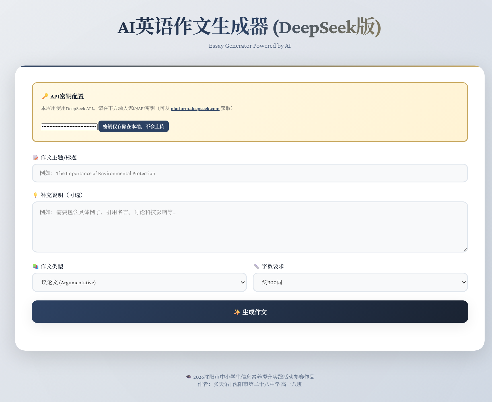
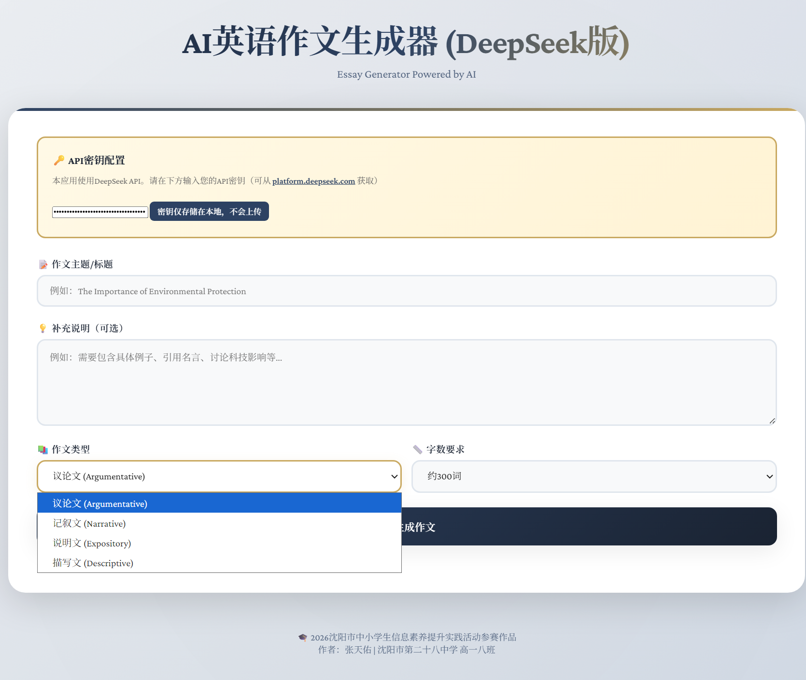
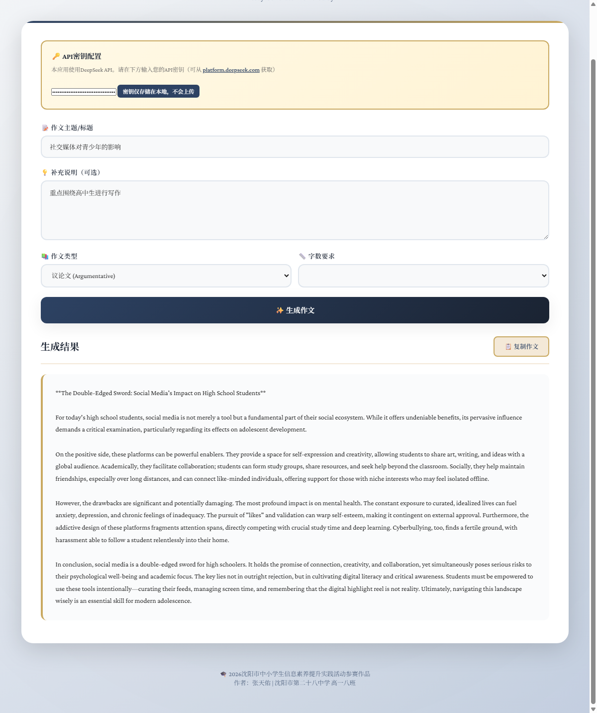

# 🎓 AI英语作文生成器 (tianyouAi)

[](LICENSE)
[](https://developer.mozilla.org/en-US/docs/Web/HTML)
[](https://developer.mozilla.org/en-US/docs/Web/CSS)
[](https://developer.mozilla.org/en-US/docs/Web/JavaScript)
[](https://www.anthropic.com/)

> 基于AI的英语作文生成器，帮助高中生学习英语写作 📝✨

[在线演示](https://secupowerab.github.io/tianyouAi/) | [项目文档](./使用说明.md) | [演示视频](#)

---

## 📖 项目简介

这是一个参加**2026年沈阳市中小学生信息素养提升实践活动**的参赛作品，属于**计算思维项目 - 创新开发（高中组）**。

本项目是一个基于人工智能技术的英语写作辅助工具，可以根据用户输入的主题和要求，自动生成高质量的英语作文，帮助学生学习不同类型的写作结构和表达方式。

### 🎯 项目信息
- **作者**: 张天佑
- **学校**: 沈阳市第二十八中学 高一八班
- **开发时间**: 2026年4月
- **技术栈**: HTML5 + CSS3 + JavaScript + Claude API

---

## ✨ 功能特点

### 📝 核心功能
- ✅ **多种作文类型**: 支持议论文、记叙文、说明文、描写文
- ✅ **灵活字数选择**: 200-500词自由调节
- ✅ **自定义要求**: 可添加补充说明和特殊需求
- ✅ **即时生成**: 快速响应，5-15秒生成完整作文
- ✅ **一键复制**: 方便保存和使用

### 🎨 技术特点
- 🚀 **纯前端实现**: 单HTML文件，无需后端服务器
- 🔒 **隐私保护**: API密钥仅存储在本地浏览器
- 📱 **响应式设计**: 支持桌面、平板、手机访问
- 🎭 **优雅界面**: 精美的渐变配色和流畅动画
- 🤖 **智能提示**: 根据需求自动构建优化的提示词

---

## 🚀 快速开始

### 在线使用

直接访问在线版本：[https://secupowerab.github.io/tianyouAi/](https://secupowerab.github.io/tianyouAi/)

### 本地使用

**方法1：直接打开**
1. 下载 `essay-generator.html` 文件
2. 双击在浏览器中打开
3. 输入API密钥即可使用

**方法2：本地服务器**
```bash
# 使用Python
python -m http.server 8000

# 访问 http://localhost:8000/essay-generator.html
```

### 获取API密钥

**Anthropic版本（推荐）**
1. 访问 [console.anthropic.com](https://console.anthropic.com)
2. 注册账号并创建API密钥
3. 在应用中输入密钥

**DeepSeek版本**
1. 访问 [platform.deepseek.com](https://platform.deepseek.com)
2. 注册并创建API密钥
3. 使用 `essay-generator-deepseek.html`

详细说明请查看 [使用说明.md](./使用说明.md)

---

## 📸 界面展示

### 主界面

*优雅的渐变背景和精美的UI设计*

### 作文生成

*支持多种类型和字数的作文生成*

### 结果展示

*清晰的结果展示和一键复制功能*

---

## 📁 项目结构

```
tianyouAi/
├── essay-generator.html          # 主程序（Anthropic版本）
├── essay-generator-deepseek.html # DeepSeek版本
├── index.html                    # 首页重定向
├── README.md                     # 项目说明
├── 使用说明.md                    # 详细使用手册
├── 安装部署指南.md                # 部署教程
├── 演示脚本.md                    # 演示视频脚本
├── API替换指南.md                 # API切换说明
├── 项目总览.md                    # 快速开始指南
├── .gitignore                    # Git忽略文件
└── screenshots/                   # 截图文件夹
    ├── main-interface.png
    ├── generation.png
    └── result.png
```

---

## 🛠️ 技术实现

### 前端技术
- **HTML5**: 页面结构
- **CSS3**: 样式设计
  - CSS变量管理主题
  - Flexbox/Grid布局
  - 动画和过渡效果
- **JavaScript (ES6+)**: 
  - Fetch API调用
  - LocalStorage本地存储
  - 异步编程

### API集成
- **Anthropic Claude API**
  - 模型: claude-sonnet-4-20250514
  - 最大Token: 2000
  - 智能提示词工程

### 设计元素
- Google Fonts字体
- 渐变背景和阴影
- 流畅的加载动画
- 响应式媒体查询

---

## 🎯 创新点

### 技术创新
1. **纯前端AI应用**: 无需后端，降低部署复杂度
2. **智能提示构建**: 根据用户选择自动优化提示词
3. **隐私优先设计**: API密钥本地存储，不上传服务器
4. **响应式单页应用**: 一个HTML文件包含所有功能

### 应用创新
1. **教育场景应用**: 将AI技术应用于英语学习
2. **用户体验优化**: 简洁直观的操作流程
3. **多版本支持**: 提供不同API选择方案
4. **即学即用**: 生成结果可立即用于学习参考

---

## 📚 使用指南

### 基本使用流程

1. **配置密钥**
   - 在"API密钥配置"区域输入你的API密钥
   - 密钥会自动保存到浏览器本地

2. **输入主题**
   - 在"作文主题/标题"框输入英文主题
   - 例如: "The Importance of Reading"

3. **选择参数**
   - 选择作文类型（议论文/记叙文/说明文/描写文）
   - 选择字数（200/300/400/500词）
   - 可选：添加补充说明

4. **生成作文**
   - 点击"生成作文"按钮
   - 等待5-15秒
   - 查看生成的作文

5. **复制使用**
   - 点击"复制作文"按钮
   - 粘贴到需要的地方

### 高级技巧

**优化主题输入**
- ✅ 具体明确: "The Impact of Social Media on Teenagers"
- ❌ 过于宽泛: "Social Media"

**善用补充说明**
```
要求：
- 包含正反两方观点
- 至少两个具体例子
- 引用一句名言
- 以个人观点结尾
```

**多次生成对比**
- 同一主题可以生成多次
- 对比不同版本的优点
- 学习不同的写作角度

详细使用技巧请查看 [使用说明.md](./使用说明.md)

---

## 🚢 部署指南

### GitHub Pages 部署（推荐）

1. **Fork或上传项目到GitHub**
2. **进入仓库设置**
   - Settings → Pages
   - Source: 选择 `main` 分支
   - Folder: 选择 `/ (root)`
3. **访问网站**
   - `https://secupowerab.github.io/tianyouAi/essay-generator.html`

详细步骤请查看 [安装部署指南.md](./安装部署指南.md)

---

## 🎬 演示视频

### 视频要求
- 时长: ≤5分钟
- 大小: ≤300MB
- 格式: MP4

### 视频内容
1. 项目介绍（30秒）
2. 功能演示（3分钟）
3. 技术亮点（1分钟）
4. 总结展望（30秒）

完整脚本请查看 [演示脚本.md](./演示脚本.md)

---

## 📋 参赛材料

### 提交清单
- [x] 软件作品（源代码）
- [x] 软件说明文档
- [x] 安装使用说明
- [ ] 演示视频（待录制）

### 文件命名
- `AI英语作文生成器-源代码-张天佑.zip`
- `AI英语作文生成器-项目说明-张天佑.pdf`
- `AI英语作文生成器-安装说明-张天佑.pdf`
- `AI英语作文生成器-演示视频-张天佑.mp4`

---

## ⚠️ 注意事项

### 使用建议
- ✅ 作为学习参考和写作灵感
- ✅ 理解内容后进行改写
- ✅ 学习文章结构和表达方式
- ❌ 不建议直接提交为作业

### 隐私安全
- API密钥仅存储在浏览器本地
- 不会上传到任何服务器
- 建议定期更换密钥
- 不要分享密钥给他人

### 浏览器兼容性
- ✅ Chrome 90+
- ✅ Edge 90+
- ✅ Firefox 88+
- ✅ Safari 14+
- ❌ IE浏览器不支持

---

## 🔄 版本历史

### v1.0.0 (2026-04-09)
- ✨ 初始版本发布
- ✅ 支持4种作文类型
- ✅ 支持200-500词字数选择
- ✅ 提供Claude和DeepSeek两个版本
- ✅ 完整的文档和演示脚本

---

## 🤝 贡献

欢迎提出建议和改进意见！

如果你有好的想法，可以：
1. 提交 Issue
2. 发起 Pull Request
3. 联系作者交流

---

## 📄 许可证

本项目采用 MIT 许可证 - 详见 [LICENSE](LICENSE) 文件

---

## 👨‍🎓 作者信息

**张天佑**
- 学校: 沈阳市第二十八中学 高一八班
- 项目: 2026年沈阳市中小学生信息素养提升实践活动参赛作品
- 类别: 计算思维项目 - 创新开发（高中组）

---

## 🙏 致谢

感谢以下技术和服务：
- [Anthropic Claude API](https://www.anthropic.com/) - 提供强大的AI能力
- [DeepSeek](https://www.deepseek.com/) - 提供国内友好的AI服务
- [Google Fonts](https://fonts.google.com/) - 提供优质字体
- [GitHub Pages](https://pages.github.com/) - 提供免费托管

---

## 📞 联系方式

如有问题或建议，欢迎反馈！

**GitHub仓库**: [https://github.com/secupowerAB/tianyouAi](https://github.com/secupowerAB/tianyouAi)

---

<p align="center">
  <b>Made with ❤️ for English Learning</b><br>
  <sub>© 2026 Zhang Tianyou. All rights reserved.</sub>
</p>
